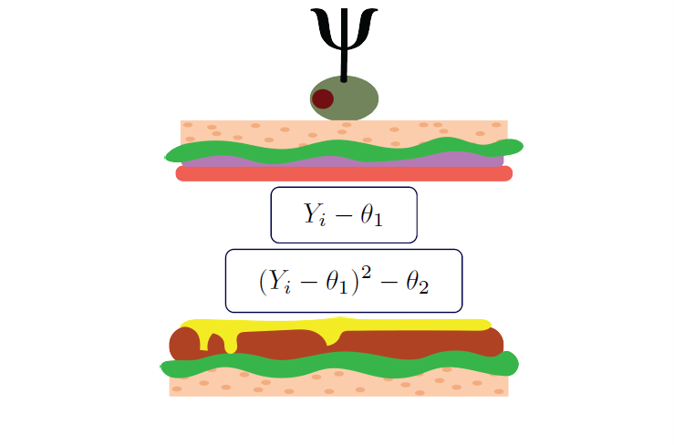
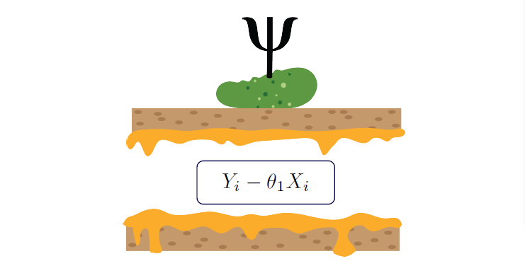
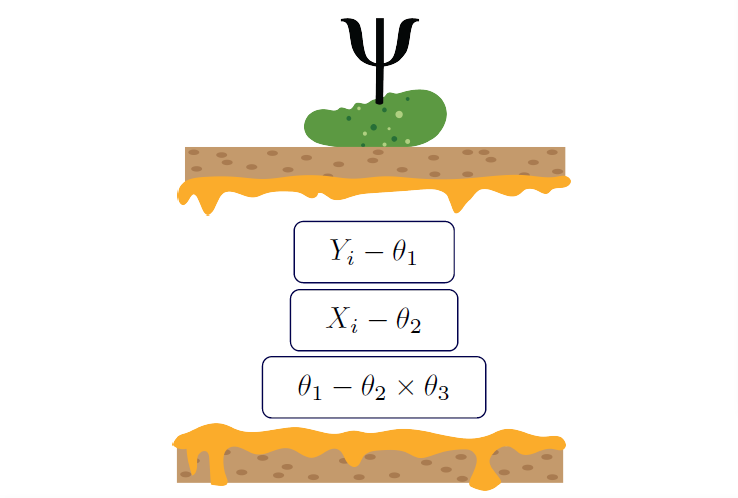
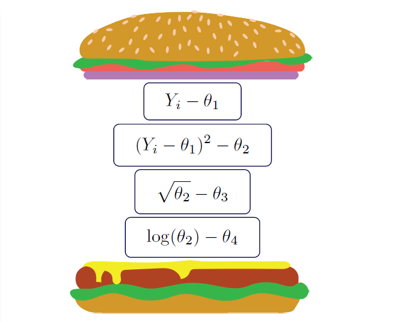
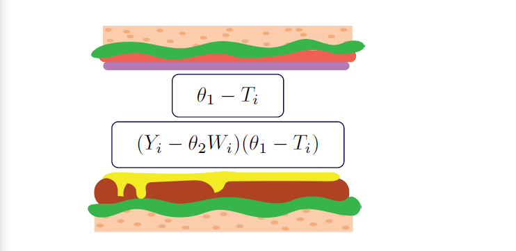
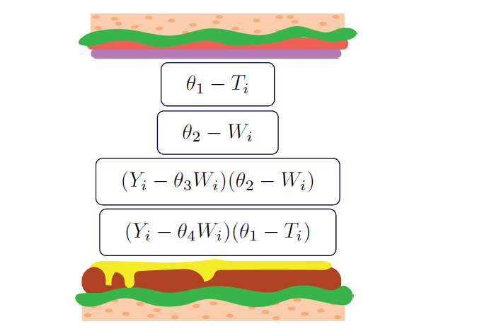
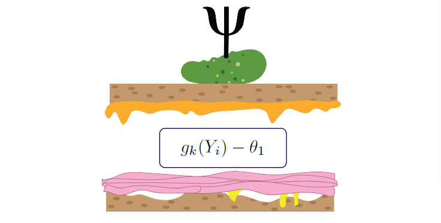
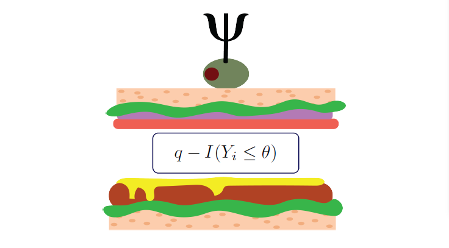
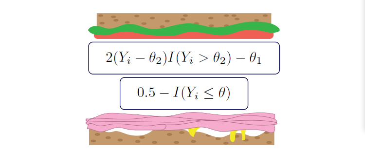
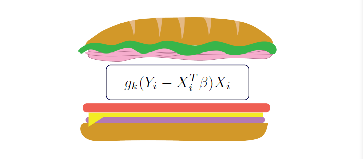

Examples
=====================================

Here, we will implement some of the examples described in Chapter 7 of Boos & Stefanski (2013). If you have the book
(or access to it), then reading along with each section may be helpful. Here, we code each of the estimating equations
by-hand (rather than using the pre-built options).

Boos DD, & Stefanski LA. (2013). M-estimation (estimating equations). In Essential Statistical Inference
(pp. 297-337). Springer, New York, NY.

To replicate the following examples, please load the following libraries as shown

.. code::

    import numpy as np
    import pandas as pd
    from delicatessen import MEstimator

    np.random.seed(80950841)

Sample Mean (7.2.2)
-------------------------------

First, we demonstrate a simple estimating equation for the mean and variance. The estimating equations are

To demonstrate the example, we will use some generic data for :math:`Y`. Below is an example data set that will be
used up to Section 7.2.6:

.. code::

    n = 200
    data = pd.DataFrame()
    data['Y'] = np.random.normal(loc=10, scale=2, size=n)
    data['X'] = np.random.normal(loc=5, size=n)
    data['C'] = 1

    # Subsetting the data for 7.2.2
    y = np.asarray(data['Y'])

For use with the M-estimator in ``delicatessen``, we need to write the Python analog of the estimating equation math.
Below is one way we can do this. Notice that the shape of the returned array in 2-by-n.

.. code::

    def psi(theta):
        mean = y - theta[0]
        vari = (y-theta[0])**2 - theta[1]
        return mean, vari

Once we have written up our stacked estimating equations, ``MEstimator`` can be called to solve for
:math:`\hat{\theta}` and the sandwich variance. We can do that via

.. code::

    estr = MEstimator(psi, init=[0, 1])
    estr.estimate()

    print(estr.theta)                # [10.163  4.112]
    print(estr.asymptotic_variance)  # [[ 4.112, -1.674], [-1.674, 36.164]]

The M-Estimator solves for :math:`\hat{\theta}` via a root finding procedure given the initial values in ``init``.
Since the variance must be >0, we provide a positive initial value. For the sandwich variance, ``delicatessen`` uses a
numerical approximation procedure for the bread matrix. This is different from the closed-form variance estimator
provided in Chapter 7, but both should return approximately the same answer. The advantage of the numerically
approximating the derivatives is that this process can be done for arbitrary estimating equations.

Ratio (7.2.3)
-------------------------------

Now consider if we wanted to estimate the ratio between two means. For estimation of a ratio, we can consider the
following estimating equation

We can translate the estimating equation from math into python as

.. code::

    def psi(theta):
        return data['Y'] - data['X']*theta

Now, we can pass this estimating equation and data to ``MEstimator``

.. code::

    estr = MEstimator(psi, init=[1, ])
    estr.estimate()

    print(estr.theta)                # [2.082]
    print(estr.asymptotic_variance)  # 0.338

As you may notice, only a single initial value is provided (since only a single array is being returned). Furthermore,
we provide an initial value >0 since we are estimating a ratio.

There is another set of stacked estimating equations we can consider for the ratio. Specifically, we can estimate each
of the means and then take the ratio of those means (rather than doing everything simultaneously). Below is this
alternative set of estimating equations

Translating this to an estimating equation in Python

.. code::

    def psi(theta):
        mean_y = data['Y'] - theta[0]
        mean_x = data['X'] - theta[1]
        ratio = (np.ones(data.shape[0]) *
                 (theta[0] - theta[1]*theta[2]))
        return mean_y, mean_x, ratio

    estr = MEstimator(psi, init=[0, 0, 1])
    estr.estimate()

    print(estr.theta)  # [10.163,  4.880,  2.082]

Here, we used a trick to make sure the dimension of ``ratio`` stays as :math:`n`, we use ``np.ones``. Without
multiplying by the array of ones, ``ratio`` would be a single value. However, ``MEstimator`` expects a
:math:`3 \times n` array. Multiplying the 3rd equation by an array of 1's ensure the same dimension.

Also notice this form requires the use of 3 ``init`` values, unlike the other ratio estimator. As before, the ratio
initial value is set >0 to be nice to the root-finding algorithm.

Delta Method (7.2.4)
-------------------------------

The delta method has been used in a variety of contexts, including estimating the variance for transformations of
parameters. Instead of separately estimating the parameters, transforming the parameters, and then using the delta
method to estimate the variance of the transformed parameters; we can apply the transformation in an estimating
equation and automatically estimate the variance for the transformed parameter(s) via the sandwich variance. To do this,
we stack the estimating equation for the transformation into our set of estimating equations. Below is the
mean-variance estimating equations stacked with two transformations of the variance

These equations can be expressed programmatically as

.. code::

    def psi_delta(theta):
        mean = data['Y'] - theta[0]
        variance = (data['Y'] - theta[0])**2 - theta[1]
        sqrt_var = (np.ones(data.shape[0])*np.sqrt(theta[1])
                    - theta[2])
        log_var = (np.ones(data.shape[0])*np.log(theta[1])
                   - theta[3])
        return (mean, variance, sqrt_var, log_var)

Notice the use of the ``np.ones`` trick to ensure that the final equations are the correct shapes.

.. code::

    estr = MEstimator(psi, init=[0, 1, 1, 1])
    estr.estimate()

    print(estr.theta)  # [10.163, 4.112, 2.028, 1.414]

Here, there are 4 parameters, so ``init`` must be provided 4 values.

Instrumental Variable (7.2.6)
-------------------------------

Consider the following instrumental variable approach to correcting for measurement error of a
variable. Here, :math:`Y` is the outcome of interest, :math:`X` is the true, unmeasured variable, :math:`W` is the
possibly mismeasured variables, and :math:`T` is the instrument for :math:`X`.

The first set of estimating equations consider in Chapter 7 are

To demonstrate the example, below is some generic simulated data in the described instrumental variable context

.. code::

    n = 500
    data = pd.DataFrame()
    data['X'] = np.random.normal(size=n)
    data['Y'] = 0.5 + 2*data['X'] + np.random.normal(loc=0, size=n)
    data['W'] = data['X'] + np.random.normal(loc=0, size=n)
    data['T'] = -0.75 - 1*data['X'] + np.random.normal(loc=0, size=n)

The previous estimating equations can be translated as

.. code::

    def psi(theta):
        return (theta[0] - data['T'],
                (data['Y'] - data['W']*theta[1])*(theta[0] - data['T']))

    estr = MEstimator(psi, init=[0.1, 0.1, ])
    estr.estimate()

    print(estr.theta)  # [-0.777,  1.769,]

As mentioned in the chapter, certain joint distributions may be of interest. To capture these additional distributions,
the estimating equations were updated to

Again, we can easily translate these equations for ``delicatessen``,

.. code::

    def psi(theta):
        return (theta[0] - data['T'],
                theta[1] - data['W'],
                (data['Y'] - data['W']*theta[2])*(theta[1] - data['W']),
                (data['Y'] - data['W']*theta[3])*(theta[0] - data['T'])
                )

    estr = MEstimator(psi, init=[0.1, 0.1, 0.1, 0.1])
    estr.estimate()

    print(estr.theta)  # [-0.777, 0.005, 0.964, 1.769]

This example further demonstrates the flexbility of M-estimation through the ability to stack estimating equations together.

Robust Location (7.4.1)
-------------------------------

To begin, we generate some generic data used for this example and several of the following

.. code::

    y = np.random.normal(size=250)
    n = y.shape[0]

For the robust mean, the estimating equation proposed by Huber (1964) is

where :math:`k` indicates the bound, such that if :math:`x>k` then :math:`k`, or :math:`x<-k` then :math:`-k`,
otherwise :math:`x`. Below is the estimating equation translated into code

.. code::

    def psi_robust_mean(theta):
        k = 3                          # Bound value
        return np.clip(y - theta, a_min=-k, a_max=k)

    estr = MEstimator(psi_robust_mean, init=[0.])
    estr.estimate()

    print(estr.theta)  # [-0.0126]

Notice that the estimating equation here is not smooth (i.e., non-differentiable at :math:`k`).

Quantile Estimation (7.4.2)
-------------------------------

Despite the sandwich variance needing the function to be smooth at :math:`\theta` (so it is differentiable),
estimating equations for non-smooth do exist. For example, the estimating equations for the sample quantile
is

It is this section, that we need to talk about different root-finding methods, and numerically approximating
derivatives. In the previous examples, we had smooth function that were both easy to find the roots of and had smooth
functions for derivatives. However, that is not the case for quantile estimation.

In general, root-finding with estimating equations not smooth at :math:`\hat{\theta}` is extremely difficult. It may
require judicious selection of a root-finding algorithm, adjusting the error tolerance, and using smoothing methods to
evaluate the bread matrix. As such, I generally do not recommend using ``delicatessen`` with non-smooth estimating
equations, which are not smooth at :math:`\hat{\theta}` (like percentiles).

Positive Mean Deviation (7.4.3)
-------------------------------

For another non-smooth estimating equation(s), we can talk about the positive mean deviation. The estimating equations
are

where :math:`\theta_1` is the positive mean deviation and :math:`\theta_2` is the median.

The estimating equations can be translated into code by

.. code::

    def psi_deviation(theta):
        return ((2 * (y - theta[1]) * (y > theta[1])) - theta[0],
                1/2 - (y <= theta[1]), )

As before, this estimating equation is not smooth at :math:`\hat{\theta}_2`

Linear Regression (7.5.1)
-------------------------------

For linear regression, the estimating equation is

For the following examples, the following generic simulated data is used

.. code::

    n = 500
    data = pd.DataFrame()
    data['X'] = np.random.normal(size=n)
    data['Z'] = np.random.normal(size=n)
    data['Y'] = 0.5 + 2*data['X'] - 1*data['Z'] + np.random.normal(loc=0, size=n)
    data['C'] = 1

As with all the preceding estimating equations, there are multiple ways to code these. Since linear regression involes
matrix manipulations for the programmed estimating equations to return the correct format for
``delicatessen``, we highlight two variations here.

First, we present a for-loop implementation of the estimating equation

.. code::

    def psi(theta):
        # Transforming to arrays
        X = np.asarray(d[['C', 'X', 'W']])
        y = np.asarray(d['Y'])
        beta = np.asarray(theta)[:, None]
        n = X.shape[0]

        # Where to store each of the resulting estimates
        est_vals = []

        # Looping through each observation
        for i in range(n):
            v_i = (y[i] - np.dot(X[i], beta)) * X[i]
            est_vals.append(v_i)

        # returning 3-by-n object
        return np.asarray(est_vals).T

As the second approach, a vectorized version is used

.. code::

    def psi_regression(theta):
        x = np.asarray(data[['C', 'X', 'Z']])
        y = np.asarray(data['Y'])[:, None]
        beta = np.asarray(theta)[:, None]
        return ((y - np.dot(x, beta)) * x).T

    estr = MEstimator(psi_regression, init=[0., 0., 0.])
    estr.estimate()

    print(estr.theta)  # [0.477, 2.123, -0.852]

While these two approaches give the same answer, vectorized versions will generally be faster than for-loop variations
(but may be less 'human readable'). Having said that, it is easier to make a mistake with a vectorized version. We
would generally recommend creating a for-loop version first (and then creating a vectorized version if that for-loop
is too slow).

Robust Regression (7.5.4)
-------------------------------

The next example is robust regression, where the standard linear regression model is made robust to outliers.
We use :math:`f_k()` from 7.4.1 but now apply it to the residuals of the regression model. The estimating equations are

Taking the previous vectorized version of the linear regression model and building in the :math:`f_k()` function,

.. code::

    def psi_regression(theta):
        X = np.asarray(data[['C', 'X', 'Z']])
        y = np.asarray(data['Y'])[:, None]
        beta = np.asarray(theta)[:, None]
        k = 1.345

        # Generating predictions and applying Huber function for robust
        preds = np.asarray(y - np.dot(X, beta))
        preds = np.clip(preds, a_min=-k, a_max=k)

        # Output b-by-n matrix
        return (preds * X).T

    estr = MEstimator(psi_regression, init=[0., 0., 0.])
    estr.estimate()

    print(estr.theta)  # [0.491, 2.05, -0.795]

You'll notice that the coefficients have changed slightly here. That is because we have reduced the extent of outliers
on the estimation of the linear regression parameters (however, our simulated data mechanism doesn't really result in
major outliers, so the change is small here).

Additional Examples
-------------------------------
Additional examples are provided `here<https://github.com/pzivich/Delicatessen/tree/main/tutorials>`_ .
